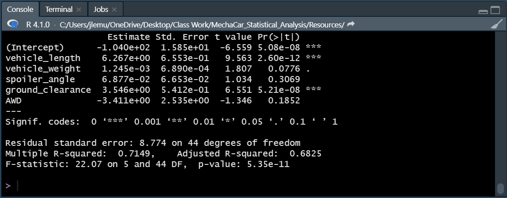
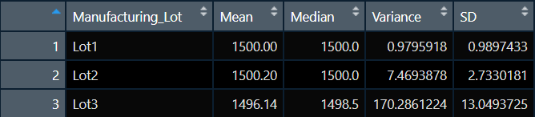
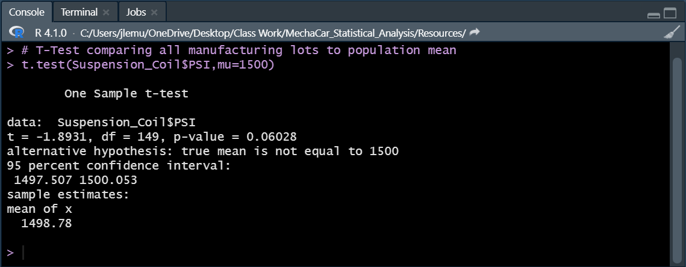
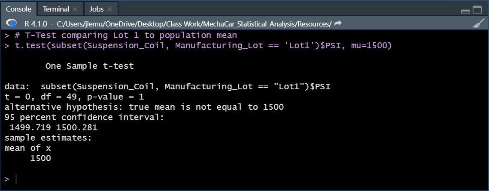
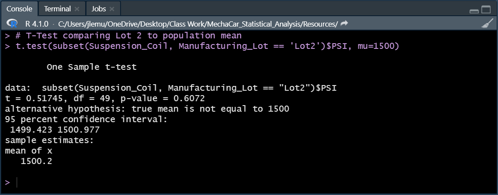
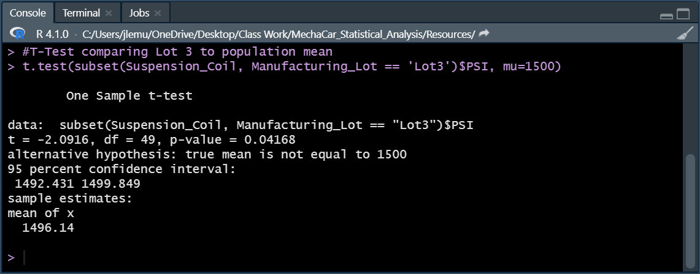

# MechaCar_Statistical_Analysis

## Project Overview

## Resources
- R 4.1.0
- RStudio

## Linear Regression to Predict MPG

  

### Results
- According to the multiple linear regression model, vehicle length and ground clearance are statistically unlikely to provide random amounts of variance since their p-values are below 0.05. Since the p-values for those variables are below the standard significance level of 5 percent and even a 1 percent significance level, we can presume that vehicle length and ground clearance significantly impact mpg values. It is also worth noting that the intercept is statistically significant. 
- The null hypothesis for linear regression states that the slope of the linear model is equal to zero. In contrast, the alternative hypothesis states that the slope of the linear model is not equal to zero. Since the overall p-value for the model is 5.35e-11, which is well below a 1 percent significance level, we have sufficient evidence to reject the null hypothesis. Therefore, the slope is not zero.
- The R-squared(0.71) value for our model indicates that roughly 71 percent of the variability of our dependent variable can be explained with our multiple linear regression model. Therefore, our linear model can effectively predict mpg to a certain extent.

## Summary Statistics on Suspension Coils
<h3 align="center"> Total Summary </h3>

  

<h3 align="center"> Summary for Each Lot </h3>

  

### Results
According to the design specifications for the MechaCar suspension coils, the variance of the coils must not exceed 100 PSI. If we look at the table that aggregates and summarizes the data from all manufacturing lots, the variance(62.29 PSI) meets the specification requirements. However, when we calculate the summary statistics by manufacturing lot, we can see that manufacturing lot 3 has a variance(170.29 PSI) exceeding the required specification. The variation in lot 3 indicates abnormal observations that deviate from the quality standards set forth. Further investigation is required. 

## T-Tests on Suspension Coils
<h3 align="center"> T-Test on all Manufacturing Lots </h3>

  

<h3 align="center"> T-Test on Manufacturing Lot 1 </h3>

  

<h3 align="center"> T-Test on Manufacturing Lot 2 </h3>

  

<h3 align="center"> T-Test on Manufacturing Lot 3 </h3>

  

### Results
To test whether the suspension coil means from our samples are statistically different from the population mean of 1,500 PSI, we performed multiple T-Tests on the data acquired from all manufacturing lots and the data obtained from each manufacturing lot. The following hypotheses were tested:
- Null Hypothesis: There is no statistical difference between the sample mean and population mean
- Alternative Hypothesis: The is a statistical difference between the sample mean and population mean

The preliminary test on all manufacturing lots yielded a p-value equal to 0.06. Using a five percent significance level, we cannot reject the null hypothesis since the p-value acquired from the test is greater than the significance level we used. 
Considering the p-value we obtained from all manufacturing lots is on the cusp of the significance value, we ran T-tests on each lot to see if any of the lots were statistically different. The mean suspension coil PSI of lot 1 and lot 2 is not statistically different from the population mean, considering that their p-values are 1 and 0.61, respectively. With p-values well over the 5 percent significance level, we fail to reject the null hypothesis for those lots. 

However, the results obtained from lot 3 suggest that there is a statistical difference between their mean and the population mean. With a p-value of 0.042, we would reject the null hypothesis. Additionally, the confidence interval for lot 3 is between 1492.43 PSI and 1499.85 PSI. We can 95 percent confident that the sample mean for lot 3 is between those values, and since the population mean is not contained within that interval, we could state that the two means are statistically different. The results from lot 3 are consistent with the summary statistics table we calculated earlier.
## Study Design: MechaCar vs Competition 
Further statistical analysis would be beneficial to ensure the performance of MechaCar against the competition. By making MechaCar stand out in the consumer's minds, we can facilitate more sales and brand awareness. Consumers are presumably concerned with the total cost of ownership and reliability when purchasing vehicles. Considering the substantial financial commitment, consumers are interested in metrics such as maintenance costs, upfront costs, and performance. To ensure that MechaCar stands out, we could test those metrics and compare them against the population mean of vehicles of the same class (e.g., sedan, sports, etc.). For example, we would like MechaCar to have lower upfront and maintenance costs but better performance measures such as horsepower, torque, and braking distance. We could implement a one-sided t-test for factors related to costs to see if there is a statistical difference between the mean upfront and maintenance cost between MechaCar and the population of cars in the same class. We want to prove that MechaCar has a lower cost of ownership than the competition, so our hypotheses could be the following for our one-sided t-test:

- H0: The mean cost of ownership for MechaCar is greater than or equal to the mean cost of ownership of the population of cars in the same class.
- HA: The mean cost of ownership for MechaCar is less than the mean cost of ownership of the population of cars in the same class. 

Regarding performance, we want to prove that MechaCar performs better than the competition. Higher hp, higher torque, and lower breaking distance are generally considered better performance measures. Our Hypotheses would be the following for the one-sided t-tests:

- H0: The mean hp/torque of MechaCar is less than or equal to the mean hp/torque of the population
- HA: The mean hp/torque of MechaCar is greater than the mean hp/torque of the population

- H0: The mean braking distance of MechaCar is greater than or equal to the mean braking distance of the population
- HA: The mean braking distance of MechaCar is less than the mean braking distance of the population.

Using the mean of the metrics mentioned above, we can relay that information to consumers in our marketing efforts to emphasize the exceptional features of MechaCar. 
